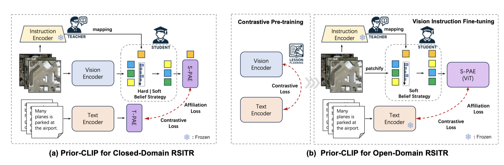

<p align="center">
    
</p>
<div align="center">
<h1 align="center">PriorCLIP: Visual Prior Guided Vision-Language Model for Remote Sensing Image-Text Retrieval</h1>

<h4 align="center"><em>Jiancheng Pan,     Muyuan Ma,     Qing Ma,     Cong Bai✉,     Shengyong Chen</em></h4>

\* Corresponding Author ✉

</div>

<p align="center">
    <a href="https://arxiv.org/abs/2405.10160"></a>
    <a href="https://github.com/jaychempan/PriorCLIP/blob/main/LICENSE"></a>
</p>

<p align="center">
  <a href="#news">News</a> |
  <a href="#abstract">Abstract</a> |
  <a href="#model">Model</a> |
  <a href="#dataset">Dataset</a> |
  <a href="#statement">Statement</a>
</p>

## News
- [2025/5/17] We have open sourced the code of PriorCLIP.
- [2024/5/16] Our paper of "PriorCLIP: Visual Prior Guided Vision-Language Model for Remote Sensing Image-Text Retrieval" is up on [arXiv](https://arxiv.org/abs/2405.10160).


## Abstract
Remote sensing image-text retrieval plays a crucial role in remote sensing interpretation, yet remains challenging under both closed-domain and open-domain scenarios due to semantic noise and domain shifts. To address these issues, we propose a visual prior-guided vision-language model, PriorCLIP, which leverages visual priors for unbiased representation learning and adaptive vision-language alignment. In the closed-domain setting, PriorCLIP introduces two Progressive Attention Encoder (PAE) structures: Spatial-PAE constructs a belief matrix with instruction embeddings to filter key features and mitigate semantic bias. At the same time, Temporal-PAE exploits cyclic activation across time steps to enhance text representation. For the open-domain setting, we design a two-stage prior representation learning strategy, consisting of large-scale pre-training on coarse-grained image-text pairs, followed by fine-tuning on fine-grained pairs using vision-instruction, which enables robust retrieval across long-tail concepts and vocabulary shifts. Furthermore, a cluster-based symmetric contrastive Attribution Loss is proposed to constrain inter-class relations and alleviate semantic confusion in the shared embedding space. Extensive experiments on RSICD and RSITMD benchmarks demonstrate that PriorCLIP achieves substantial improvements, outperforming existing methods by 4.9% and 4.0% in closed-domain retrieval, and by 7.3% and 9.4% in open-domain retrieval, respectively.




## Model
### Environments
base on `open_clip` environments, you can click here [open_clip](https://github.com/mlfoundations/open_clip).

### Train
If using Affiliation loss, add `is_aff_loss` where the label information is obtained by `image_name` from datasets. For example, we can train PriorCLIP using the follow commad:
```
python -m training.main \
    --save-frequency 1 \
    --report-to tensorboard \
    --train-data="path/to/webdataset/tar" \
    --dataset-resampled \
    --train-num-samples num_dataset \
    --dataset-type webdataset \
    --warmup 10000 \
    --batch-size=512\
    --precision amp \
    --lr=1e-5 \
    --wd=0.5 \
    --epochs=20 \
    --workers=4 \
    --model=PIR \
    --is_aff_loss
```
or parallel training as
```
torchrun --nproc_per_node 2 \
    --rdzv_endpoint=$HOSTE_NODE_ADDR \
    -m training.main \
    --save-frequency 1 \
    ...
```
### Retrieval
Retrieval evaluation on [CLIP Benchmark](https://github.com/ChenDelong1999/RemoteCLIP) and checkpoints can download from here: [Baidu Disk](https://pan.baidu.com/s/15KMR8bizO_6eXZHejEiTbQ?pwd=wpef).
```
python retrieval.py \
    --model-name "PIR" \
    --retrieval-images-dir "path/to/images" \
    --retrieval-json-dir "path/to/dataset.json" \
    --remoteclip-path "./checkpoints/PriorCLIP_RET-3.pt"
```
## Dataset

All experiments are based on [RSITMD](https://github.com/xiaoyuan1996/AMFMN/tree/master/RSITMD), [RSICD](https://github.com/201528014227051/RSICD_optimal) datasets and pre-training dataset [RS5M](https://github.com/om-ai-lab/RS5M).

### Citation

If you are interested in the following work, please cite the following paper.

```
@inproceedings{pan2023prior,
  title={A Prior Instruction Representation Framework for Remote Sensing Image-text Retrieval},
  author={Pan, Jiancheng and Ma, Qing and Bai, Cong},
  booktitle={Proceedings of the 31st ACM International Conference on Multimedia},
  pages={611--620},
  year={2023}
}

@misc{pan2024pir,
      title={PIR: Remote Sensing Image-Text Retrieval with Prior Instruction Representation Learning}, 
      author={Jiancheng Pan and Muyuan Ma and Qing Ma and Cong Bai and Shengyong Chen},
      year={2024},
      eprint={2405.10160},
      archivePrefix={arXiv},
      primaryClass={cs.CV}
}
  
```
